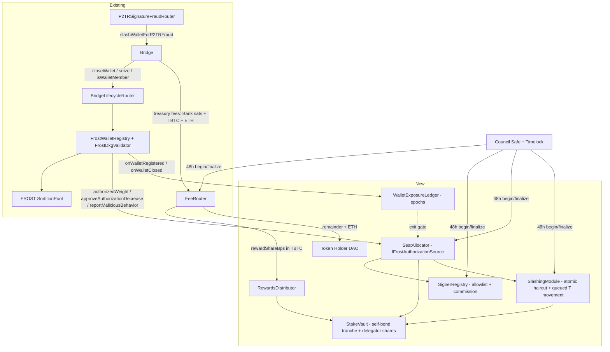

# Delegated Proof-of-Stake for FROST Signers — Initial Design

**Status:** Draft for discussion · **Scope:** re-introduction of staking after the FROST/ROAST migration
**Depends on:** FROST registry train (tbtc-v2 #971 / keep-core FROST stack), P2TR fraud rail (#1007/#1024/#1029, #1039 COMPLETE_V2)

---

## 0. The honest framing, up front

Stake in this design does **not** economically secure BTC custody. A captured 51-of-100 wallet at `walletCreationMaxBtcBalance` (100 BTC) is worth millions; the maximum slashable stake for the seats that signed the theft is five figures. **Threshold-honesty and DAO allowlist curation remain the actual custody guarantees.** What staking buys is: (1) a real (if partial) deterrent and a funded restitution mechanism where today's `seize` is an event-only no-op — with capital at risk behind each curated, equally-weighted signer; (2) an incentive channel — bridge-fee revenue share — that pays operators and their delegators for carrying signing duty and slashing risk. Every claim below should be read through that lens, and delegator-facing material must say so.

## 1. Summary

We re-introduce staking as a **delegated PoS layer purpose-built around FROST seats**, plugged into the two seams the FROST migration already created:

- **`IFrostAuthorizationSource`** — the FROST registry's pluggable authorization interface (`authorizedWeight`, `approveAuthorizationDecrease`, `rolesOf`, `reportMaliciousBehavior`), currently implemented by `FrostAllowlist` (a DAO weight table with event-only slashing), explicitly designed so "future permissionless or bonded sources can be introduced."
- **Bridge `treasury`** — the single address receiving deposit/redemption treasury fees (Bank satoshis) and adjacent to the optimistic-minting fee (TBTC in `TBTCVault`), changeable by one 48-hour governed action.

Six new peripheral contracts (SignerRegistry, StakeVault, SeatAllocator, WalletExposureLedger, FeeRouter + RewardsDistributor, SlashingModule) implement: a DAO-curated operator allowlist with **equal seat weight**; non-custodial delegation that scales an operator's **fee-reward share and slashing exposure** (not signing power); slashing wired only to evidence the chain can actually verify; **operator** stake exit gated on wallet lifecycle while **delegator** stake unbonds on a fixed cooldown; and a four-phase rollout from today's fixed roster where every phase is independently shippable and enable-by-one-delayed-action.

The Bridge core is not modified in v1. No new token, no liquid-staking token, no inflationary rewards (TIP-100 ended T emissions); rewards come solely from bridge fee revenue, and they come **last** in the rollout.

This design was produced from a multi-agent investigation of the tbtc-v2 and keep-core codebases (fee plumbing, wallet lifecycle, legacy staking stack, FROST client membership, P2TR fraud-proof rail, governance rails) and external DPoS precedents (Cosmos/LSM, EigenLayer, Lido, Rocket Pool, SSV/Obol, Babylon), followed by two competing designs and an adversarial red-team pass. The three most consequential red-team corrections are baked in: **atomic slash accounting at report time** (§8), **governance restraint** on ejection/retirement powers (§10), and — the decision that most shaped the model — **equal seat weight per allowlisted signer** (§5), so signing power comes purely from DAO curation and cannot be bought or concentrated by stake, while delegation drives rewards and slashing only.

### Goals

1. DAO-maintained allowlist of signers; only allowlisted operators receive FROST seats.
2. Outside parties delegate stake to an operator non-custodially. Delegation drives (Phase 3) a share of bridge-fee revenue net of operator commission, and slashing exposure — **not** signing power: seat weight is equal across allowlisted signers (§5), so delegation is a pure economic layer on a chosen operator.
3. Delegators share slashing risk pro-rata, including while exiting.
4. **Operator** self-bond remains slashable while the operator holds live key shares for any BTC-holding wallet: operator exit couples to wallet retirement. **Delegator** stake unbonds on a fixed cooldown, relying on the operator's self-bond first-loss tranche as the guaranteed coverage floor (§7) — passive capital is not locked to the operator's wallet lifecycle.
5. Phased, reversible rollout from the current fixed roster.

### Non-goals

- No change to FROST cryptography, DKG, or client seat selection (seats are already decided by the on-chain sortition pool's weighted `selectGroup`).
- No mid-wallet membership or weight changes — membership freezes at DKG approval by construction.
- No liquid/transferable staking shares in v1; no redelegation in v1.
- No pretense of full economic security for custody (§0).

## 2. Where staking stands today (investigated baseline)

- **Selection**: `Bridge.requestNewWallet` → FROST registry DKG → sortition pool `selectGroup(groupSize, seed)`, weighted sampling **with replacement** — one operator can hold many seats; the keep-core client already treats multi-seat as first-class (per-seat DKG participants, signers, ROAST coordinators, anchor-admission slots) and auto-syncs pool weight via `eligibleStake`/`updateOperatorStatus`. A stake-weighted design plugs in by changing what `eligibleStake` returns; the client follows automatically.
- **Authorization**: post-TIP-092/100, `Allowlist`/`FrostAllowlist` impersonates TokenStaking toward the registry. Weights are DAO-assigned constants; there is **no weight-increase path** for an existing provider; `seize`/`reportMaliciousBehavior` is an **event-only no-op** — nothing is at stake.
- **Slashing evidence**: the full rail Bridge → BridgeLifecycleRouter → `FrostWalletRegistry.seize(amount, rewardMultiplier, notifier, walletID, membersIDs)` → `IFrostAuthorizationSource.reportMaliciousBehavior` exists and is tested down to per-member staking-provider resolution. What can be **proven on-chain today**: timer offenses (redemption / moving-funds / moved-funds-sweep timeouts) and DKG-result challenges. The P2TR signature-fraud rail (BIP-340 verify ≈1.9M gas + BIP-341 sighash reconstruction; challenge/defeat/timeout router) exists but is **not sound yet**: payload caps allow oversized fraud txs to escape challenge, the outpoint-only defeat is unsafe until #1029 lands, and mainnet frauds are disabled at genesis. ROAST blame/equivocation evidence is off-chain and claim-based (explicitly not proof-carrying); FROST heartbeat→Bridge retirement callback is deliberately omitted this phase.
- **Revenue**: deposit treasury fee (currently divisor 0 = off on the working branch), redemption treasury fee (TIP-109: 20 bps), optimistic-minting fee (20 bps, minted as TBTC to `bridge.treasury()`), plus confiscated fraud-challenge ETH. All legs converge on the treasury address (today: Token Holder DAO). A live T fee-waiver program draws down the same stream.
- **Governance**: Council Safe 6/9 + Timelock (24h) + BridgeGovernance begin/finalize (48h). No on-chain DAO executor; committee-scale operations only (TIP-103).

## 3. Actors & roles

| Actor                           | Role                                                                                                                                                                                                                                                   |
| ------------------------------- | ------------------------------------------------------------------------------------------------------------------------------------------------------------------------------------------------------------------------------------------------------ |
| **Council / DAO**               | Curates the allowlist (48h two-step add, delayed deactivation, emergency ejection), tunes parameters (48h begin/finalize), owns upgrade rails (ProxyAdmin → Timelock). Assumed to be an address (Council Safe), not an on-chain DAO contract.          |
| **Operator** (staking provider) | Allowlisted signing entity. Registers node operator address (immutable 1:1), posts **self-bond** (first-loss), sets commission, runs capability-gated keep-core builds.                                                                                |
| **Delegator**                   | Any address. Delegates T to one operator's pool; receives non-transferable internal shares; earns net rewards (Phase 3); bears slashing pro-rata **including during exit**. Never touches keys or infrastructure — delegation is economic weight only. |
| **Notifier / challenger**       | Permissionless. Submits fraud challenges (ETH escrow) and timeout notifications; paid a multiplier of seized stake.                                                                                                                                    |
| **Existing machinery**          | Bridge, BridgeLifecycleRouter, FrostWalletRegistry, FROST SortitionPool, P2TR fraud routers — unchanged interfaces.                                                                                                                                    |

## 4. Staked asset — decision: T

**Recommendation: T token, single-asset.**

1. **No reflexivity.** Staking tBTC would make the slashing collateral the very asset a signer theft destroys — the insurance burns down with the house.
2. **Plumbing fit.** Pool weight divisor 1e18 (1 weight ≈ 1 T), `uint96` amounts, the 40,000 T minimum-authorization precedent, Bridge slash amounts denominated in T, and live T-handling precedent in `RebateStaking`.
3. **Governance alignment.** T holders govern the allowlist; making them the slashable class closes the incentive loop and restores T utility post-TIP-100.

**If the DAO decides otherwise:** the StakeVault holds one immutable `stakeToken`; switching changes deploy config plus the weight divisor and slash denominations. tBTC-as-stake adds the reflexivity problem; ETH/LSTs/multi-asset require price oracles to keep weight and slash amounts commensurable — rejected for v1. **Deconfliction rule:** the same T must not count for both the live fee-waiver program and signing weight; the StakeVault is a separate balance and the DAO should state explicitly that balances are not cross-recognized.

## 5. Seat model: equal weight per allowlisted signer

**Signing power is uniform across curated operators; it is not stake-weighted.** Every eligible Active operator gets the **same** seat weight, so seat selection is a uniform draw over the allowlist. Delegation and self-bond amounts do **not** buy signing power — delegation drives fee distribution and slashing exposure only (§8, §9). This is a deliberate decision (see §14): once rewards track uncapped capital (§8), stake-weighted seats buy nothing economically — they would only concentrate signing responsibility and reintroduce the concentration failure this model exists to avoid.

```
seatWeight = (isActive(p) AND selfBond ≥ minSelfBond) ? equalSeatWeight : 0
poolWeight = seatWeight / 1e18         // identical for every eligible operator ⇒ uniform sortition
```

- **`equalSeatWeight` = 40,000 T** — a constant, identical for all eligible operators. Its absolute value is immaterial to selection (everyone equal); it must only clear the FROST registry's own `minimumAuthorization` floor (else operators become pool-ineligible) and fit `uint96`.
- **`minSelfBond` = 40,000 T** — the **sole** economic gate on signing: skin-in-the-game floor and first-loss tranche depth. Below it, seat weight is 0. Delegation cannot substitute for it.
- **Allowlist curation is the decentralization control.** With uniform weight over N allowlisted operators, each gets ≈ `groupSize/N` seats in expectation, so K colluding identities need K/N ≥ the signing-threshold share — i.e. a **majority of the allowlist** — to capture a wallet, _regardless of capital_. Corrupting signing means corrupting the allowlist, which was always the real trust boundary. No `λ`, no `maxOperatorWeight` — those existed only to bound stake-weighted concentration and are removed.
- **`maxSeatsPerWallet` = 0 at Phase-0 deployment; 12 is the later activation target (retained as a guard, no longer load-bearing).** A non-zero cap is enforced at DKG-result validation by rejecting any member set where one pool-ID-resolved operator exceeds it. Under equal weight its anti-cartel role is subsumed by uniformity — each operator's per-wallet share is already ≈ `100/N` — so it degrades to a **variance/per-node-load guard**: it bounds the multinomial tail (an operator occasionally drawing many seats) and per-seat client cost (DKG messages, signing shares, anchor-admission slots). **Rollout/liveness rule:** rejection-based caps are unsafe while the Phase-0 FrostAllowlist is small or weight-skewed. Keep the cap disabled until SeatAllocator equal weights are active and at least 30 operators are eligible; at N = 30, a uniform 100-seat draw exceeds 12 seats for some operator about 0.09% of the time (the probability is about 2.9% at N = 20 and 22% at N = 15). Governance then deploys a cap-12 validator and installs it through `updateDkgValidator` while DKG is IDLE. Before reducing the eligible roster below 30 or leaving equal weights, governance must swap back to a cap-0 validator. This is an operational probability bound, not a mathematical guarantee; if 12 becomes a hard node-capacity limit, the cap must remain disabled until cap-constrained selection replaces rejection.
- **Effectivity.** Seat weight changes only when an operator crosses the eligibility boundary (added/removed, or self-bond crossing `minSelfBond`); it propagates at sortition-pool sync (permissionless `updateOperatorStatus`) and matters only at the next `selectGroup`. Delegation changes never move seat weight. Membership of existing wallets never changes — **no retroactivity**. Cadence: `walletCreationPeriod` = 1 week, DKG-IDLE gated.

## 6. Contract architecture



All new contracts: TransparentUpgradeable proxies (ProxyAdmin → Timelock), Solidity 0.8.17, `uint256[49]` storage gaps, parameters via an external library (the BridgeGovernanceParameters idiom) to stay under EIP-170.

- **SignerRegistry** — allowlist + operator metadata. `Operator {status: None|Active|Deactivating|Ejected, operator, beneficiary, commissionBps, pendingCommissionBps, commissionEffectiveAt, statusChangeAt}`. `addOperator` (Council, 48h two-step), `beginDeactivation/finalizeDeactivation` (Council, 48h + lifecycle drain), `ejectOperator` (Council, instant — §10), `declareCommission` (operator, 30-day notice, rate-limited). Replaces `FrostAllowlist` as the allowlist _and_ economics home.
- **StakeVault** — **singleton** vault, per-operator pools, two tranches: `selfBond[provider]` (operator-only, **first-loss**) and delegated share accounting (`shares[provider][delegator]`, `totalShares`, `delegatedAssets`). `depositSelfBond`, `delegate`, `requestUndelegate`, `finalizeUndelegate`, `applySlash` (SlashingModule-only: self-bond to zero first, then `delegatedAssets` haircut — share price drops pro-rata including pending exits), `creditReward` (distributor-only). Shares are non-transferable.
- **SeatAllocator** — implements `IFrostAuthorizationSource` verbatim. Computes §5 weight; calls registry `authorizationIncreased`/`authorizationDecreaseRequested` on stake changes; enforces the exit gate inside `approveAuthorizationDecrease` (reverting there is safe — it is an exit path; `reportMaliciousBehavior` must never revert). `rolesOf` returns the SignerRegistry beneficiary.
- **WalletExposureLedger** — the lifecycle-coupling primitive. Registry calls `onWalletRegistered(walletID, providers[], seatCounts[])` at `approveDkgResult` and `onWalletClosed(walletID)` at `closeWallet` (reached by both closure and termination). Per provider: `liveWalletCount`, monotone `walletEpoch`, oldest-live-epoch pointer → O(1) "which live wallets does this stake back." Costs ~1–2M gas once per weekly DKG approval at ≤35 unique operators — accepted.
- **FeeRouter** — becomes the Bridge `treasury` (one 48h `finalizeTreasuryUpdate`, fully reversible). Accepts Bank-balance satoshis, TBTC (OM fee — see §8.1), and ETH. The ETH leg is **not a fee**: it is confiscated challenger escrow from _defeated_ (false) fraud challenges — `Fraud.sol` sends the challenger's deposit to `treasury` on defeat (on challenge _timeout_, i.e. real fraud, the ETH is refunded to the challenger plus reward), via a 100k-gas low-level call whose failure the Bridge silently ignores. The FeeRouter therefore needs a minimal `receive()` that always succeeds within that stipend, or confiscated ETH strands in the Bridge. Being rare, adversarial-event revenue, 100% of ETH passes through to the DAO — it is never part of the staking reward share. Permissionless `distribute()`: Bank sats → TBTC via `bank.approveBalance(tbtcVault, x); tbtcVault.mint(x)`; `rewardShareBps` → RewardsDistributor; remainder + all ETH → Token Holder DAO. Zero-revenue periods are a no-op.
- **RewardsDistributor** — TBTC-denominated `accPerWeight` accumulator with per-operator checkpoints on every weight change; commission split at operator pool level; `claimRewards` in TBTC (§8).
- **SlashingModule** — §9. Atomic accounting at report; short queued execution for T movement only.

**Deliberately absent in v1:** any Bridge-core change. The forced-retirement trigger (`notifyWalletRetirementRequested`) proposed in one design variant is **deferred** — as specified it is a Council-controlled force-any-wallet-into-MovingFunds lever with cascade risk (`Allowlist.sol`'s own warning: shrinking the signer set can cascade moving-funds; MovingFunds is unbounded when `liveWalletsCount == 0`). Until it ships (later phase, behind an on-chain successor-capacity guard and staged tooling), ejected operators' wallets drain via existing triggers: redemption timeouts, `notifyWalletCloseable` (age/balance), and `walletMaxAge` = 26 weeks.

## 7. Delegation mechanics

**Delegate.** `delegate(provider, amount)` pulls T into the vault, mints internal shares at current share price. Non-custodial: only the delegator's exit or the SlashingModule moves those tokens. Weight rises at next pool sync; affects only future wallets.

**Undelegate — delegator exit is a fixed cooldown, not lifecycle-gated:**

1. **Requested.** `requestUndelegate(provider, shares)` records `{shares, requestedAt}` and queues the shares. They remain in the pool: **still slashable, still earning** until finalize.
2. **Delay.** The fixed `undelegationDelay` cooldown (default 45 days) runs from `requestedAt`.
3. **Finalize gate — two checks only.** `finalizeUndelegate` requires (a) the cooldown elapsed and (b) **no pending slash references the operator** (§9 — the pending-slash block plus the atomic-at-report haircut close the escape race). It does **not** wait on wallet retirement.
4. **Released.** Shares burn at _current_ share price — any slash reported during the wait was already borne pro-rata — and T returns to the delegator.

Why not lifecycle-gate the delegator? Delegated stake is passive capital, and the guaranteed live-wallet slashing collateral is the operator's **self-bond first-loss tranche** (which _is_ lifecycle-coupled, §9), and it over-covers realistic slashes (per-seat self-bond 40,000 T ≫ per-seat slash ~500–5,000 T). Coupling delegated stake to the operator's full wallet lifecycle would lock passive capital for up to ~8 months for a coverage guarantee self-bond already provides — the single biggest driver of the "delegation demand ~zero" risk (§8). A fixed cooldown sized to the offense-detection window (see §10) covers offenses reported during the window; later ones on still-live wallets are covered by self-bond. Every comparable system (Cosmos 21d, EigenLayer 14+14d, Babylon ~7d) uses a fixed unbonding timer for exactly this reason.

**Exit-time disclosure (mandatory UX):** a delegator's exit is **predictable and bounded by `undelegationDelay`** (~30–45 days) — no dependence on wallet retirement. During the cooldown the shares stay slashable (a reported slash blocks finalize and is borne pro-rata); afterward they finalize regardless of the operator's live wallets.

**Operator self-bond exit — kept lifecycle-gated.** Because operators hold the wallets' live key shares and are the first-loss tranche, `finalizeSelfBondWithdrawal` retains the full lifecycle gate (cooldown **plus** every backed wallet Closed/Terminated **plus** no pending slash), so an operator's skin-in-the-game cannot leave while their wallets guard BTC. This exit _is_ bounded by wallet retirement — up to ~26 weeks Live + MovingFunds (≥7d, unbounded without successor wallets) + 40 days Closing. Dropping self-bond below `minSelfBond` while Active is forbidden; a full self-bond exit runs alongside SignerRegistry deactivation. **Redelegation: not in v1** — exit-then-re-enter is the v1 path.

## 8. Rewards (Phase 3 — last, and gated on viability)

**Capture.** One 48h action points Bridge `treasury` at the FeeRouter; equally reversible. Three legs unified into TBTC (1 sat = 1e10 wei via TBTCVault); ETH passes through to the DAO.

**Distribution — reward weight is uncapped capital; seat weight is equal (§5).** Reward allocation across operators tracks each operator's **uncapped delegated capital** (`rewardWeight = selfBond + delegatedAssets`, gated only on the operator being an eligible active signer), fully independent of seat weight — which is equal for everyone. `accPerWeight += reward × 1e18 / totalRewardWeight` per `distribute()`, checkpointed per operator on every capital or active-status change. Within a pool: `commissionBps × R` to the operator beneficiary; the rest credited to the pool's share price (self-bond participates pro-rata too, so operators earn commission + their own stake's share). Delegators `claimRewards(provider)` in TBTC.

Signing power and revenue are fully decoupled: **signing** comes from curation and is equal across operators (§5); **revenue** tracks the capital an operator and its delegators put at risk. This is fair and symmetric — you earn ∝ capital and you are slashed ∝ capital (§9) — and it matches the "solicit delegation to increase rewards" premise without a ceiling. Consequences, accepted by design: (1) reward share can concentrate on operators who attract the most capital, while signing power cannot (it's uniform) — the two are decoupled on purpose; (2) an operator can run a large _rewarded_ pool on the minimum self-bond (signing is equal regardless, delegators are protected by the first-loss self-bond tranche on slashing); (3) there is **no dilution cliff** — more delegation raises the pool's reward slice proportionally, so it never dilutes existing delegators. Pending-exit capital keeps earning until finalize (§7), consistent with staying slashable — with one boundary: the "keeps earning" rule is about **delegator** undelegations, whose operator stays an eligible signer. An **operator** who drops their own effective self-bond below `minSelfBond` (including via a queued self-bond withdrawal) ceases to be a qualified signer, so their whole pool's reward weight goes to 0 immediately — the same wind-down state as deactivation/ejection, reached by another path. This is conservative and safe (never over-pays, never pays a non-signer); delegators of a winding-down operator stop accruing and unbond on the normal fixed cooldown (§7).

**Commission changes:** 30-day declared notice, max +500 bps per notice, bounds 0–2,500 bps; an increase applies **only to rewards accrued after the notice matures**, and since delegator unbonding is a fixed ~30–45-day cooldown (§7), a delegator who dislikes a raise can actually exit before it bites (SSV declare/execute; the notice ≈ the cooldown by design).

### 8.1 OM-deprecation variant (expected post-FROST/ROAST)

Optimistic minting exists to bridge the sweep-confirmation delay; with FROST/ROAST-era minting-speed work it is expected to be deprecated. Assuming that:

- **FeeRouter collapses to a single-denomination pipeline.** The OM fee is the only leg arriving as TBTC ERC-20 (minted to `bridge.treasury()` by the vault). Without it, revenue is Bank satoshis only — deposit + redemption treasury fees, landing deterministically at SPV proof time — plus the incidental ETH above: sats in → one `tbtcVault.mint()` conversion → TBTC out. No second inflow path in `distribute()`, no ambiguity about where TBTC balances originated.
- **One governance rail instead of two.** Both surviving fee knobs are Bridge divisors behind BridgeGovernance's 48h two-step; the TBTCVault 24h OM-fee rail drops out of reward budgeting.
- **The OM machinery interplay disappears** (minters/guardians/pause, OM-throttle debt caps): fee accrual becomes purely SPV-proof-driven, so distributor-vs-Bridge-events reconciliation is deterministic and the Phase 3 exit criterion covers two legs, not three.
- **Vault dependency shrinks but survives:** FeeRouter still uses core `mint()` (`TBTCVault.sol:85`, Bank sats → TBTC), which is core vault functionality untouched by OM deprecation. Caveat: `TBTCVault is TBTCOptimisticMinting` by inheritance, so deprecation operationally means zero minters / fee divisor 0 / paused — a full vault _swap_ instead would move token ownership plus the entire Bank balance via the delayed vault-upgrade path, and the FeeRouter pointer must follow.
- **The catch — companion fee decision required.** The OM fee is one of the two live ~20 bps legs (TIP-109: 20 bps mint + 20 bps redemption; deposit divisor 0 on the working branch). Deprecating OM deletes it and halves an already-thin stream unless the deposit-side fee is recaptured at the Bridge: migrate the ~20 bps into `depositTreasuryFeeDivisor` = 500 (which TIP-109 already queued). Economically equivalent for depositors, lands as Bank sats at sweep proof (slightly later than OM finalize), and — since `RebateStaking`'s hooks cover exactly the deposit/redemption treasury fees — makes the entire reward stream rebate-aware, reducing the viability model below to a single-stream calculation.

**Viability gate (red-team S1 — do not skip).** At current parameters the stream is thin: deposit fee is off (divisor 0 on the working branch), redemption and mint fees are 20 bps each, and the live fee-waiver program draws down the same stream. TIP-100 eliminated ~$8.5M/yr of T rewards as unjustified; a fee-only share is smaller. **Phases 1–2 must be designed to work with zero delegator rewards** (self-bond + curation only). Before enabling Phase 3, model expected APY at actual bridge volumes net of waivers; if it does not clear a sensible risk premium for a 6–9-month-locked, slashable position, delegation demand will be ~zero and rewards should stay off rather than advertise a broken promise.

## 9. Slashing & accountability

**Design rule: chain-verifiable evidence slashes stake; attestation-grade evidence docks rewards.** All stake slashing arrives through the existing rail ending at `SeatAllocator.reportMaliciousBehavior(amount, rewardMultiplier, notifier, providers[])`, with one array entry per seat — multi-seat operators are penalized per seat automatically.

**Timing (red-team B1 fix — the load-bearing correction).** `reportMaliciousBehavior`:

1. **Never reverts** (a reverting seize would brick the Bridge's timeout/fraud notification paths — Bridge does not try/catch it).
2. **Books the haircut atomically at report time**: self-bond reduced first (to zero), then `delegatedAssets` reduced — the share price drops in the same transaction the offense is proven. Bounded work, no external token transfers.
3. **Enqueues the T-movement leg** (`PendingSlash {providers, amounts, notifier, rewardMultiplier}`): a permissionless `executeSlash` after ≤24h moves the already-segregated T — notifier reward first (`rewardMultiplier` ∈ [0,100]%), remainder to a DAO-controlled **restitution reserve** (bridge users, not the token, are the victims; slashed T is not burned). Executor incentive 1%.
4. **`finalizeUndelegate` is blocked while any `PendingSlash` references the operator** — with (2), this closes the race where a delegator exits at full share price between a fraud-terminated wallet's `onWalletClosed` and slash execution.

**No Council veto on objective offenses.** Timer offenses and verified signature fraud are machine-checkable; a standing veto would convert "delegators share slashing risk" into "…unless the Council likes the operator." The Council retains only a **pause on the T-movement leg** (accounting is already booked) and discretion over attestation-adjacent cases, with a published sunset (e.g., remove after N clean executions).

| Offense                                                                                                    | Evidence (on-chain)                                                                                          | Penalty (initial)                                                                                                      | Submitter                                                            | Live when?                                                |
| ---------------------------------------------------------------------------------------------------------- | ------------------------------------------------------------------------------------------------------------ | ---------------------------------------------------------------------------------------------------------------------- | -------------------------------------------------------------------- | --------------------------------------------------------- |
| P2TR signature fraud (wallet signed an unauthorized BIP-341 key-path sighash; not proven legitimate in 7d) | P2TR fraud router challenge → timeout verdict (on-chain BIP-340 verify + sighash reconstruction)             | **5,000 T × seats**, self-bond first; wallet terminated                                                                | Any challenger (5 ETH escrow, ~5.2M gas Submit; refunded + rewarded) | After compact-evidence fix + fraud re-enable (see caveat) |
| Redemption / moving-funds / moved-funds-sweep timeout                                                      | Existing on-chain timers (`Wallets.sol` notify paths)                                                        | **500 T × seats**; wallet moved/terminated per existing rules                                                          | Permissionless notifier                                              | Phase 1                                                   |
| Malicious DKG result                                                                                       | `challengeDkgResult` + `IsDkgResultValid`                                                                    | **10,000 T** (submitter's provider)                                                                                    | Any member/watcher in challenge window                               | Phase 1                                                   |
| Inactivity / failed heartbeats                                                                             | Threshold-signed (t=51) InactivityClaim → `notifyOperatorInactivity`                                         | **Rewards only**: 2-week reward-ineligibility mirrored in the distributor; repeat offenses → Council deactivation case | Wallet signing quorum                                                | Phase 1                                                   |
| ROAST aborts / equivocation / coordination faults                                                          | **None on-chain today** (observer claims; equivocation evidence is self-incriminating but has no chain path) | Nothing in v1; earmarked for proof-carrying blame                                                                      | —                                                                    | Future                                                    |

**Honest caveats.**

- Mainnet frauds are disabled at genesis (deposit = uint96-max, slashing 0) and the P2TR router has the unfixed payload-cap bypass (an oversized fraud tx escapes challenge) plus the unsafe outpoint-only defeat until #1029; so at Phase 1 the _live_ slashable set is **timer + DKG offenses only**. The design anticipates the #1039 pre-authorization model ("fraud = valid wallet signature whose identity is not in the authorized set") — a strictly stronger and cheaper offense definition that slots into the same seize path unchanged. Do not market signature-fraud protection before that rail is live.
- **Griefing analysis required before raising slash amounts** (red-team S3): moving from nominal 100 T to real money multiplies the payoff of _inducing_ honest-wallet timeouts (withheld cosigner data, watchtower-veto interactions). Every induced-timeout vector needs a writeup before the schedule above is finalized.
- Per-seat flat amounts under-price fraud for high-stake operators; stake-proportional seizure (possible behind the unchanged `reportMaliciousBehavior` signature) is the calibration open item. Once the cap-12 validator is activated, max single-wallet exposure is bounded by `maxSeatsPerWallet × amount`; before activation, the conservative bound is `groupSize × amount`.

## 10. Governance & parameters

| Parameter                                                          | Initial                                                                                        | Changed by                   | Delay                                                                                                                  |
| ------------------------------------------------------------------ | ---------------------------------------------------------------------------------------------- | ---------------------------- | ---------------------------------------------------------------------------------------------------------------------- |
| Allowlist add                                                      | —                                                                                              | Council                      | 48h two-step                                                                                                           |
| Deactivation                                                       | —                                                                                              | Council                      | 48h + lifecycle drain                                                                                                  |
| **Emergency ejection**                                             | —                                                                                              | Council                      | **Instant** (weight→0 for future wallets; live wallets drain via existing triggers — no forced-retirement lever in v1) |
| `minSelfBond`                                                      | 40,000 T                                                                                       | Council                      | 48h                                                                                                                    |
| `equalSeatWeight`                                                  | 40,000 T (uniform; must ≥ registry min-auth)                                                   | Council                      | 48h                                                                                                                    |
| **`maxSeatsPerWallet`**                                            | **0 at Phase 0; target 12 after equal weights + N ≥ 30** (validator swap; variance/load guard) | Council                      | 48h                                                                                                                    |
| `minimumAuthorization`                                             | 40,000 T                                                                                       | Council                      | 48h (existing rail)                                                                                                    |
| `undelegationDelay` (delegator cooldown; operator self-bond floor) | 45 days (viable ~14–60; recommend ~30)                                                         | Council                      | 48h (add ~14d governance minimum)                                                                                      |
| Commission bounds / step                                           | 0–2,500 bps / +500 bps                                                                         | Council                      | 48h                                                                                                                    |
| Commission (per operator)                                          | 1,000 bps default                                                                              | Operator                     | 30-day notice, accrual-forward                                                                                         |
| `rewardShareBps`                                                   | 5,000 (50%) — **deferred until viability modeled**                                             | Council                      | 48h                                                                                                                    |
| Slash amounts (fraud / timeout / DKG per seat)                     | 5,000 / 500 / 10,000 T                                                                         | Council                      | 48h + griefing analysis                                                                                                |
| `slashExecutionDelay` / executor incentive                         | ≤24h / 100 bps                                                                                 | Council                      | 48h                                                                                                                    |
| T-movement pause (not accounting)                                  | —                                                                                              | Council guardian             | Instant, sunset-tracked                                                                                                |
| Treasury ↔ FeeRouter                                               | —                                                                                              | Council via BridgeGovernance | 48h                                                                                                                    |

Instant actions are confined to ejection, the T-movement pause, and one-off set-once wiring (the `setRedemptionWatchtower`/`setRebateStaking` precedent). Everything economic is two-step delayed. Deploy scripts follow the fail-closed deploy-14 idiom: detect governed state, emit exact Council begin/finalize calldata, throw rather than silently skip; unit-tested per branch.

## 11. Rollout phases

**Phase 0 — today.** Fixed roster via FrostAllowlist; nothing at stake. The validator supports `maxSeatsPerWallet` but deploys with 0 (disabled) so a small or non-uniform genesis roster cannot brick DKG. _Exit: FROST registry + P2TR rail deployed per existing plan; governed IDLE-only validator replacement available._

**Phase 1 — allowlist + self-stake.** Deploy all six contracts; migrate roster weights (deploy-16 JSON idiom); swap authorization source FrostAllowlist → SeatAllocator via atomic `upgradeToAndCall`; delegation flag OFF; SlashingModule **record-only** first, then timer/DKG seizure enabled by one delayed action. _Exit criteria: ≥3 wallets created under stake-derived weights; slash drill (report→execute) and pause drill on testnet; one self-bond exit completed through a real wallet retirement. Reversion: point the authorization source back at FrostAllowlist._

**Phase 2 — open delegation.** Flip the delegation flag (delayed action); equal seat weight is live. Activate the cap-12 validator only after the eligible equal-weight roster reaches at least 30 operators; otherwise leave the Phase-0 cap-0 validator installed. _Exit criteria: delegations to ≥5 distinct operators; one delegator exit finalized through the full lifecycle gate; one slash borne pro-rata including a pending exit; no lifecycle stall attributable to the module. Reversion: flag off — new delegations blocked, existing positions exit normally; swap back to cap 0 before roster size or weight distribution violates the cap activation conditions._

**Phase 3 — rewards on.** Treasury → FeeRouter; `rewardShareBps > 0` — **only after** the APY model clears the risk premium (§8). _Exit criteria: two distribution cycles reconciled against Bridge fee events across all revenue legs (two under the §8.1 OM-deprecation variant); commission + claims exercised; DAO leg confirmed. Reversion: treasury back to DAO and/or bps = 0; accrued claims remain claimable._

**Rollback honesty (red-team S4):** phase reversions are real for _wiring_ (auth source, treasury pointer, flags). They do not un-slash, un-lock, or restore anything economic that already happened — created wallets live out their lives; operator self-bond exits still traverse the lifecycle gate and delegator cooldowns still run. Operator/delegator docs must state this distinction.

## 12. Client-side (keep-core) changes

Near zero for the core loop — selection, multi-seat, pool sync, and authorization views are already chain-driven. Required work:

1. **DKG validator seat-cap check** (contract-side and disabled at Phase-0 deployment): audit the client's hardcoded constants (max seats 100, pre-sign threshold 51, heartbeat fallback 70) and confirm node capacity at 12 seats/wallet (per-seat DKG, signing, anchor-admission cost) before governance activates the cap-12 validator.
2. **Capability gating at allowlist time**: the chain cannot verify builds; DAO admission checklist requires capability-flagged builds (frost_native + roast_retry) plus a testnet attestation.
3. **No changes** for delegation, rewards, or slashing — all on-chain.
4. **Future**: wire the existing self-incriminating equivocation evidence into an on-chain proof-carrying blame path (prerequisite for ROAST-level slashing, explicitly out of v1).

## 13. Risks & open questions

- **Stake ≪ custody** (§0). Open: publish a stake-to-custody ratio target; consider capping new-wallet max balance against it.
- **Operator exit-time / trapped self-bond.** Operator self-bond exit stays lifecycle-gated and can exceed 6 months, unbounded when no successor wallets exist — the _safe_ direction, but an operator's own capital can be trapped. (Delegators are unaffected — they exit on the fixed cooldown, §7.) Open: a DAO "retirement sweep" cadence for stale wallets; the deferred forced-retirement trigger (behind a successor-capacity guard) is the eventual fix.
- **Fraud rail is a gating dependency on unmerged work** (compact evidence, #1029, #1039, mainnet re-enable). Phases 1–2 slashing is timer/DKG only; delegator marketing must match.
- **Economic viability of delegation** (§8): possibly ~zero demand at current fee volumes; the design tolerates that (rewards last, zero-revenue no-ops) rather than papering over it.
- **Allowlist corruption is the real capture path** (post-seat-cap): 5+ colluding allowlisted identities. Curation process, identity diversity requirements, and Council key hygiene are security controls of the same rank as any contract invariant.
- **Induced-timeout griefing** scales with slash amounts — analysis required before raising them (§9).
- **Allowlist sizing is now a liveness parameter (§5).** The Phase-0 cap is 0, so the incrementally bootstrapped FrostAllowlist cannot be bricked by this guard. A cap-12 validator may be activated only after SeatAllocator provides equal weights and at least 30 operators are eligible, and must be replaced by a cap-0 validator before those conditions stop holding. Even then, sampling retains a small over-cap tail; this rollout accepts a probability bound, not a hard guarantee. If 12 becomes a hard node-capacity requirement, use cap-constrained selection instead of rejection. An on-chain minimum-roster precondition remains out of scope for this version.
- **Phantom-weight is moot under equal weight.** Because delegation no longer moves seat weight, exiting delegation never influences a wallet's seat allocation, so the capped-regime phantom-weight residual disappears. The `SeatAllocator` exit-gate machinery (exposure floor + decrease two-step) remains correct and still fires for self-bond/eligibility changes; it is simply inert for delegation exits, which reduce to the plain epoch gate. Follow-up: simplify that now-partly-dead machinery.
- **Delegated stake unbonds on a fixed cooldown by design (not lifecycle-coupled).** This is the deliberate model (§7), not a residual: a delegator's exit is gated only by `undelegationDelay` + the pending-slash block. This drops the wallet-lifecycle check **and** the phantom-weight/exposure-floor hold (a delegator can finalize while an authorization decrease is still awaiting registry approval), so a departed delegator's capital is not guaranteed to a wallet formed after their exit request. The guaranteed live-wallet slashing collateral is the operator's **self-bond first-loss tranche**, which stays lifecycle-coupled and over-covers realistic slashes (per-seat self-bond 40,000 T ≫ per-seat slash ~500–5,000 T). Delegated stake _is_ slashed for any offense reported while it is still in the pool (before finalize); what it does not provide is presence for the full life of a wallet the delegator has since exited. Rejected alternatives: gating delegator exit on all the operator's live wallets (locks passive capital ~8 months, kills delegation viability); epoch-cohort-aware slashing (per-wallet share-cohort accounting — complexity for a benefit self-bond already provides). **Revisit only if slash amounts are ever raised toward self-bond** (§9's griefing gate), at which point delegated collateral starts to matter and cohort accounting earns its keep.
- **Ledger reconcile is forward-only (operational mitigation).** The `WalletExposureLedger` now serves only the **operator self-bond** lifecycle gate (delegator exits no longer consult it, §7). `reconcileWalletExposure` rebuilds a desynced ledger from registry-authoritative state (members verified against `membersIdsHash`), closing the premature-unlock hole from a swallowed registration hook going forward. Because epoch assignment is lazy, a recovery re-records the wallet at a fresh epoch, so an **operator self-bond withdrawal** already in-flight during the swallow window (itself behind the ledger code-guard — a triple-conditional edge) is not retroactively re-gated. Mitigation: monitor the `WalletExposureLedgerCallFailed` event and reconcile well inside the self-bond cooldown. Follow-up: record recovered wallets at a floor epoch to over-lock-and-cover in-flight operator exits, fully closing the unsafe direction in-code.
- **Open:** stake-proportional vs. flat per-seat seizure; restitution-reserve mechanics (who claims, how); redelegation (v2); Threshold-vs-fork DAO identity for the allowlist owner (design assumes "an address," so it ports); timing of OM deprecation and the companion ~20 bps mint-fee → deposit-treasury-fee migration (§8.1).

## 14. Explicitly rejected alternatives

- **Stake-weighted seat selection** (delegation buys signing weight, `seatWeight = min(selfBond+delegated, selfBond·λ, maxOperatorWeight)`) — the original framing, rejected. Once rewards track uncapped capital (§8), stake-weighted seats add no economic benefit (delegation already earns via capital, not seats); they only concentrate signing responsibility and reintroduce delegation-concentration bricking of wallet formation (a dominant operator's weighted-with-replacement draw exceeds the seat cap, the validator rejects every result, DKG never completes). Equal weight (§5) removes the whole problem and the `λ`/`maxOperatorWeight`/capped-selection machinery, at the only cost of the "delegate to boost your operator's signing power" story — which is economically empty post-§8. The robust cross-repo capped-selection redesign that would have salvaged stake-weighted seats was scoped and dropped in favor of this.
- **TokenStaking as substrate** — single-owner stakes cannot pool independent delegators (third-party top-ups are gifts to the owner); mainnet `seize` is a TIP-100 stub; the seizure path would rest on a contract this DAO does not govern. The roles pattern is borrowed; the contract is not.
- **Extending FrostAllowlist in place** — a shim designed as a least-invasive bypass (no weight increases, event-only seize) is the wrong host for share accounting, tranches, and lifecycle gates. Same interface, new implementation.
- **Per-operator vault factories** — N audit surfaces and cross-vault slash coordination vs. one singleton with per-pool accounting.
- **Liquid/transferable shares** — breaks "who bore the slash" and exit-cohort accounting; invites risk/ownership decoupling; regulatory surface.
- **tBTC as stake** — reflexive collateral (§4).
- **Timer-only unbonding for _operator_ self-bond** — rejected: a fixed timer can't keep the first-loss tranche present across a 26-week wallet plus unbounded MovingFunds, and operators hold the key shares, so operator self-bond stays lifecycle-gated. **Timer-only unbonding for _delegator_ stake is deliberately adopted** (§7): passive capital needs the coverage the operator's self-bond first-loss already provides, not an ~8-month lock, so a fixed cooldown is correct there.
- **Sortition-pool `Rewards.sol` for fee share** — `rewardToken` is immutable (T); fees are tBTC.
- **Merkle-drop rewards as primary** — off-chain computation trust and latency; retained only as disaster fallback.
- **Slashing on ROAST blame / MisbehavedMembersIndices** — observer claims, not proofs; reward-level penalties only until proof-carrying blame exists.
- **Council slash veto on objective offenses** — accountability-censorship vector; replaced by the pause-on-movement + sunset (§9).
- **Bridge-core forced-retirement trigger in v1** — Council-controlled force-any-wallet-into-MovingFunds lever with cascade risk; deferred behind a successor-capacity guard (§6, §10).

---

_Provenance: multi-agent codebase investigation (Bridge fee/treasury plumbing incl. RebateStaking; wallet lifecycle + fraud/watchtower machinery; legacy WalletRegistry/Allowlist/sortition-pools/TokenStaking; FROST client membership + evidence machinery in keep-core; P2TR fraud-proof contracts; governance/deploy rails) + external DPoS precedent research (Cosmos/LSM, EigenLayer, Lido, Rocket Pool, SSV/Obol, Babylon; Threshold TIP-092/100/103/109 history), followed by two competing designs and an adversarial red-team review._
